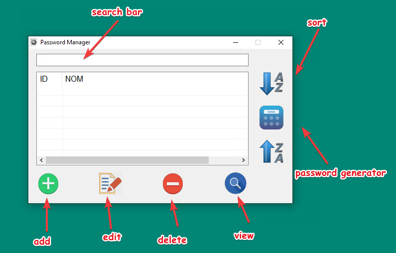

# Password Manager

## _Keep your passwords safe_

## Status

## Licence

My software is distribued under MIT licence

Note about Random function :
Copyright (C) 1997 - 2002, Makoto Matsumoto and Takuji Nishimura, All rights reserved.
Redistribution and use in source and binary forms, with or without modification, are permitted provided that the following conditions are met:
 - Redistributions of source code must retain the above copyright notice, this list of conditions and the following disclaimer.
 - Redistributions in binary form must reproduce the above copyright notice, this list of conditions and the following disclaimer in the documentation and/or other materials provided with the distribution.
 - The names of its contributors may not be used to endorse or promote products derived from this software without specific prior written permission.
THIS SOFTWARE IS PROVIDED BY THE COPYRIGHT HOLDERS AND CONTRIBUTORS "AS IS" AND ANY EXPRESS OR IMPLIED WARRANTIES, 
INCLUDING, BUT NOT LIMITED TO, THE IMPLIED WARRANTIES OF MERCHANTABILITY AND FITNESS FOR A PARTICULAR PURPOSE ARE DISCLAIMED.
 IN NO EVENT SHALL THE COPYRIGHT OWNER OR CONTRIBUTORS BE LIABLE FOR ANY DIRECT, INDIRECT, INCIDENTAL, SPECIAL, EXEMPLARY,
 OR CONSEQUENTIAL DAMAGES (INCLUDING, BUT NOT LIMITED TO, PROCUREMENT OF SUBSTITUTE GOODS OR SERVICES; LOSS OF USE, DATA,
 OR PROFITS; OR BUSINESS INTERRUPTION) HOWEVER CAUSED AND ON ANY THEORY OF LIABILITY, WHETHER IN CONTRACT, STRICT LIABILITY,
 OR TORT (INCLUDING NEGLIGENCE OR OTHERWISE) ARISING IN ANY WAY OUT OF THE USE OF THIS SOFTWARE, 
 EVEN IF ADVISED OF THE POSSIBILITY OF SUCH DAMAGE.

Also my program use scripts or functions from [the autoIt forum](https://www.autoitscript.com/forum/)

I've received help from many persons, thank to all of them, as far as I remember :

 - guinness
 - melba23
 - zedna
 
 I'm sorry if I've forgetten some members who helped me please take contact with me if you want to be on the list.

## Installation 

You can use the setup or copy/paste this files :

 - Password_Manager.exe Or Password_Manager_x64.exe
 - PWAutoBackup.exe Or PWAutoBackup_x64.exe
 
Or you can use the installer.

## How to use

_First launch_

1. Enter the name of your stockage data
2. Enter a password Ramq83Mfqzrqfqfzoplj

_Usage_

Login default is __admin__

In the login screen you can change the login name and the password.

The manager screen :

When you quit the app a backup of your base is running.

